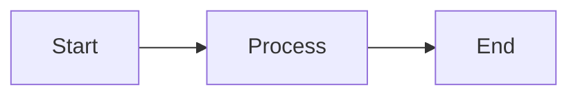

# Documentation for Project

This is a test documentation file. Here are some features I want to test in Markdown.

## Table of Contents

- [Documentation for Project](#documentation-for-project)
  - [Table of Contents](#table-of-contents)
  - [Overview](#overview)
  - [Usage](#usage)
  - [License](#license)
  - [Diagaram](#diagaram)
  - [Math](#math)
  - [Branched](#branched)

## Overview

This file contains **documentation** about the test *repository* and its setup.

## Usage

- Clone the repository using `git clone <repository_url>`
- Navigate to the folder and start editing the files.

## License

This project is licensed under the MIT License.

```text
hello world
```

## Diagaram



## Math

$$
E = mc^2
$$

## Branched  

This was done in a branch